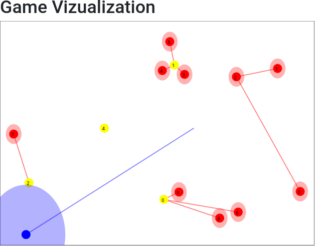

# Zombie Game
Scala implementation of the zombie game at https://www.codingame.com/multiplayer/optimization/code-vs-zombies
Used to train and test new strategies

# Main Scala Engine
The games engine was replicated with Scala code. Run the Trainer object to create and run a random game. 
The number of zombies and humans are hardcoded within this object code. 

The Decision Maker object contains the logic to tell Ash where to go. 

# The Flask Server
An application to view the games was created using Flask. 
After every game, the information for each turn is saved into a JSON, which can then be used by the Flask app to create a visual representation of the game.

# Kmeans
A Kmeans implementation was created from scratch, written in Scala, since the current strategy uses Kmeans. 

